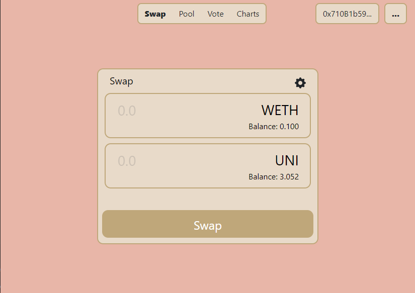
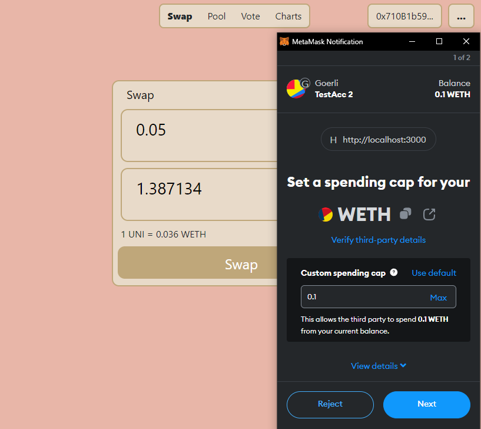

# Coinswap

Welcome to Coinswap, a recreation of the Uniswap V3 protocol, operating on the Goerli testnet. This project serves as a practical demonstration of the utilization of several powerful tools and libraries in the blockchain development ecosystem.

## Overview

Coinswap allows users to swap Wrapped Ether (WETH) for Uniswap tokens (UNI) by interacting directly with the Uniswap V3 routing contract. This project has been crafted using a stack that includes React for the frontend interface, Ethers.js for Ethereum JavaScript API, and the Uniswap SDK for interacting with the Uniswap protocol.

The clone not only replicates the functionality of Uniswap V3 but also provides an excellent foundation for anyone wishing to understand how decentralized exchanges work under the hood.

## Technologies Used

- **React** - A JavaScript library for building user interfaces
- **Ethers.js** - A complete Ethereum JavaScript API that allows you to interact with the Ethereum blockchain easily
- **Uniswap SDK** - A collection of software development tools for building on Uniswap

## Preview

Here's a sneak peek at the application:

